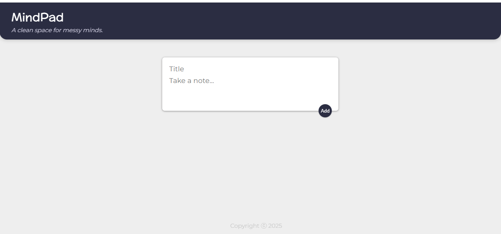
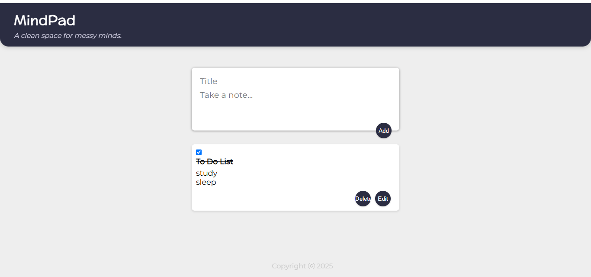

MindPad 🧠

A clean space for messy minds.
A minimalistic note-taking app inspired by Google Keep.

---

🔗 Live Demo
👉 [View MindPad on Vercel](https://mindpad-eosin.vercel.app/)

---

📌 Features
- ✅ Add new notes
- ✅ Edit existing notes
- ✅ Delete notes
- ✅ Responsive layout
- ✅ Beautiful, minimal UI with soft themes
- 🔜 Local storage
- 🔜 Search/filter notes (coming soon)
- 🔜 Color tags & pin notes (Planned)

---

🚀 Tech Stack
- React – Functional components & hooks
- CSS – Custom styles (lavender/mint theme)
- Vercel – For deployment

---

📷 Screenshots

---

🛠️ Status

This project is under active development with daily commits.  
Follow the journey and give it a ⭐️ if you like it!

---

🙌 Creator

Iffat Sattar – MERN Stack Developer  
Connect with me on [LinkedIn](https://www.linkedin.com/in/iffat-sattar-134b62182/) 